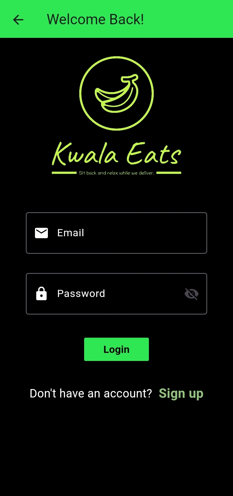
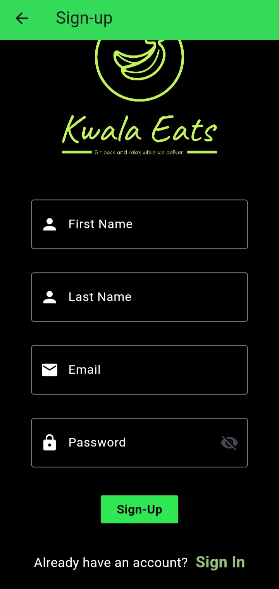
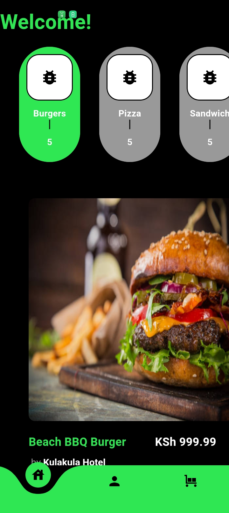
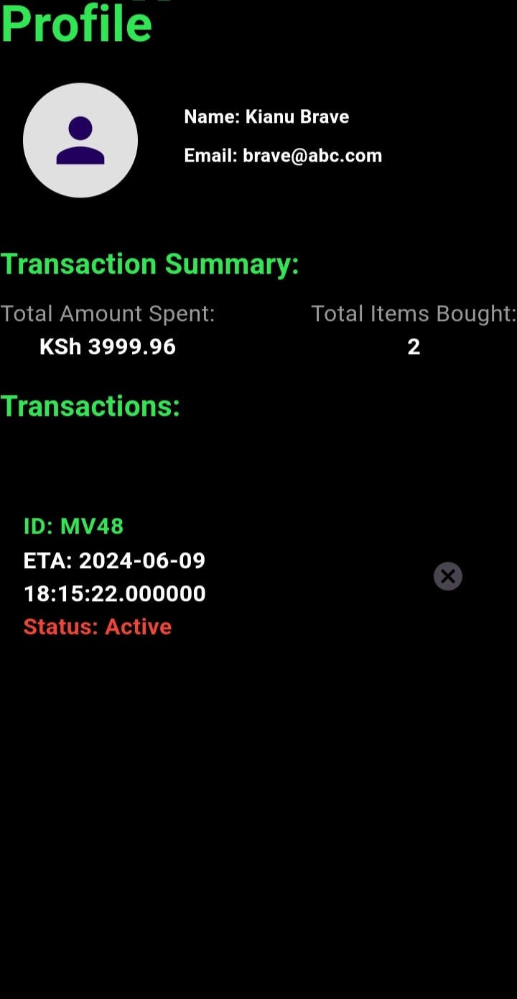
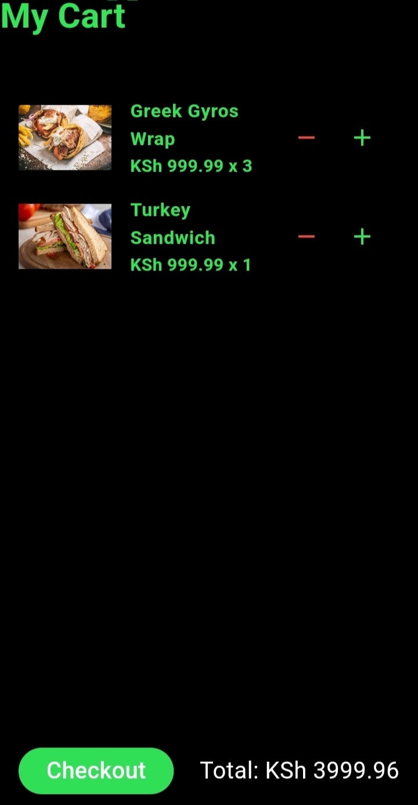

# Food Delivery App

Welcome to the Food Delivery App! This Flutter application allows users to browse, order, and manage their food deliveries efficiently.

## Table of Contents

- [Features](#features)
- [Installation](#installation)
- [Getting Started](#getting-started)
- [Usage](#usage)
- [Screenshots](#screenshots)
- [Dependencies](#dependencies)
- [Contributing](#contributing)
- [License](#license)

## Features

- **Login/Signup:** Users can log in or sign up if they don't have an account.
- **Home Page:** Displays all available foods categorized by type.
- **Bottom Navigation Bar:** Easy navigation with icons for Home, Cart, and Profile.
- **Order Food:** Tap on food items to add them to the cart.
- **Cart Page:** Adjust quantities and view the total amount before checking out.
- **Checkout:** Place orders and track them under active transactions.
- **Profile Page:** View customer details and a summary of all transactions.

## Installation

To get started with the Food Delivery App, you need to have Flutter installed on your local machine. If you haven't installed Flutter yet, follow the instructions on the [official Flutter website](https://flutter.dev/docs/get-started/install).

1. **Clone the repository:**

   ```bash
   git clone https://github.com/223Dylan/basic-flutter-food-deliery-app.git
   cd basic-flutter-food-deliery-app

2. **Install dependencies:**

   ```bash
   flutter pub get

3. **Run the app:**

   ```bash
   flutter run

## Getting Started

1. **Ensure Flutter is installed:**
Ensure you have Flutter set up on your machine. You can verify your Flutter installation by running:
   ```bash
   flutter doctor

2. **Set up an emulator or connect a physical device:**
You can use an Android Emulator, iOS Simulator, or a physical device to run the app.

3. **Run the app:**
Navigate to the project directory and use the following command to run the app:
   ```bash
   flutter run

## Usage

1. **Login/Signup:**
- Open the app to be met with a login page.
- Sign up if you don't have an account.

2. **Browse Foods:**
- Once logged in, the homepage showcases all available foods separated by category.
- Use the bottom navigation bar to switch between Home, Cart, and Profile.

3. **Order Food:**
- Tap on any food item to add it to your cart.

4. **Manage Cart:**
- Navigate to the Cart page to adjust quantities.
- View the total amount before checking out.

5. **Checkout:**
- Hit the checkout button to place your order.
- View your active transaction on the Profile page.

6. **Profile:**
- Contains customer details and a summary of all transactions.
- Active transactions are listed under the transactions section.

## Screenshots

Here are some screenshots of the Food Delivery App:

### Login Screen


### Signup Screen


### Home Screen



### Profile Screen


### Cart Screen


## Dependencies

The app uses the following dependencies:

- `flutter`: The core Flutter framework.
- `get`: ^4.6.6 - For state management and routing.
- `curved_navigation_bar`: ^1.0.3 - For the curved navigation bar.
- `shared_preferences`: ^2.2.2 - For storing simple data on the device.
- `bloc_pattern`: For managing state using the BLoC pattern.
- `rxdart`: For working with reactive programming using Dart Streams.
- `cupertino_icons`: ^1.0.2 - For iOS style icons.
- `http`: ^1.2.0 - For making HTTP requests.

You can find all the dependencies in the pubspec.yaml file.

## Contributing

Contributions are welcome! If you find any bugs or want to add new features, feel free to open an issue or create a pull request.

## License

This project is licensed under the [MIT License](LICENSE).
